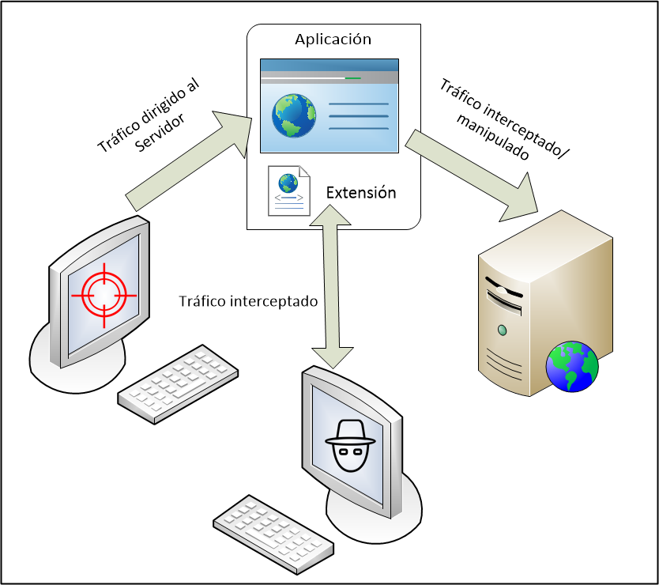

# MitB Tool

## Extensión del Navegador Google Chrome para capturar información.

### Index

1. [Project description](#project-description)
2. [Features](#features)
3. [How to run](#how-to-run)
4. [Basic usage](#basic-usage)
4. [Architecture](#architecture)

## Project description

En este trabajo se pretende desarrollar una herramienta para desplegar una ataque Man in the Browser (MitB). 

Esta constituido como una extensión del navegador Google Chrome, que intercepta las visitas del navegador donde se instala. Estas son enviadas a un servidor y almacenadas.

El presente proyecto tiene fines educativos y éticos. No me responsabilizo del mal uso que se pueda hacer de la herramienta.  

## Features

La primera versión envía las URLs de las webs visitadas y la hora de la visita.

En futuras versiones se ampliará funcionalidad.

## How to run

En el servidor de ataque.

+ El equipo usado es Ubuntu Server 18.04, con Apache, PHP y MySql.
+ Se deben copiar los ficheros gate.php y panel.php en el directorio /var/www/html.
+ Crear un archivo llamado 'fichero.txt' en el mismo directorio /var/www/html.

En el equipo víctima.

+ Se debe abrir el fichero LastUrls.js y sustitur la variable codeSvr (en la línea 4) por una cadena que contenga, codificada en Base 64, la URL del servidor de ataque, al que se envia la información, es decir `http://IP/gate.php`,  `http://dominio/gate.php`. Es importante que la url contenga el fichero gate.php, ya que esté sera el receptor de la información. 
+ En el navegador de Google Chrome, abrir extensiones (chrome://extensions/) habilitar el modo desarrollador, cargar extensión descomprimida y selecinar la carpeta LastUrl. 

## Basic usage

+ `gate.php`: recibe los datos que envía la extensión y los guarda en 'fichero.txt'.
+ `panel.php`: monitoriza la última URL y hora almacenadas en 'fichero.txt'.

Realizar navegación en Google Chrome desde el equipo víctima y comprobar desde otro navegador en la dirección del servidor de ataque `http://IP/panel.php` como se registran los datos (con cada transición y cambio de URL en el navegador de la víctima, deberían mostrarse los datos en `http://IP/panel.php`).
Adicionalmente se puede comprobar el contenido de 'fichero.txt'.

## Architecture

